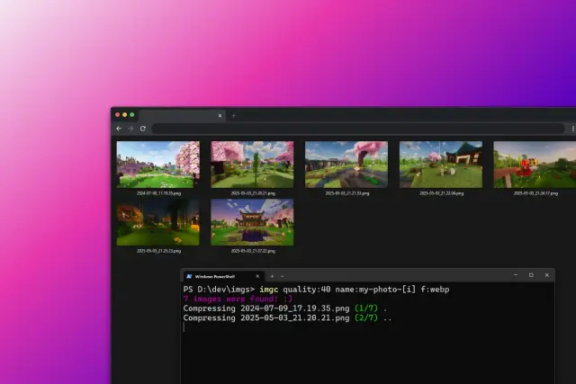

# 🖼️ IMG Compress

A simple CLI tool to compress images directly from your terminal.
Just open a terminal in your image folder, type `imgc`, and save some space.



---

## 🚀 Installation

1. **Clone the repository**

   ```bash
   git clone https://github.com/k3vndev/img-compress
   cd img-compress
   ```

2. **Install dependencies**
   (Make sure you have [UV](https://docs.astral.sh/uv/getting-started/installation/) installed)

   ```bash
   uv sync
   ```

3. **Install the tool globally**
   This makes the `imgc` command available from anywhere:

   ```bash
   pip install .
   ```


## 💡 Usage

Navigate to the folder where your images are located and run:

```bash
imgc
```
This will compress all the valid images in that folder with default settings to a new folder `./imgc_output`.


## 🧩 Arguments

| Argument           | Description                                   | Example                       |
| ------------------ | --------------------------------------------- | ----------------------------- |
| `filter-formats`   | Compress only from specific image formats     | `filter-formats:png,jpg`      |
| `format`           | Set the format to compress to                 | `format:webp`                 |
| `name`             | Set the output name or name sequence          | `name:vacations-[i]`          |
| `quality`          | Set the compressed images quality             | `quality:40`                  |

---

## 🧹 Uninstall

If you ever want to remove it:

```bash
pip uninstall img-compress
```
